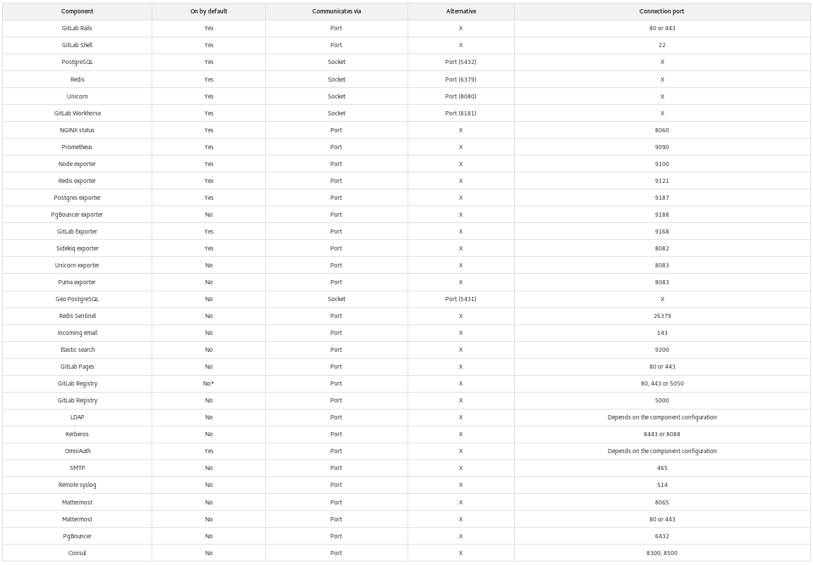

[Retour menu principal](../README.md)

## 1. Préambule

Gitlab propose des images docker monolitiques contenant tous les composants et services nécessaires au fonctionnement de Gitlab dans une image all-in-one. Cette image s’appelle Gitlab Omnibus. 

Gitlab Omnibus est un moyen de packager différents outils et services requis pour le fonctionnement de Gitlab, de manière à éviter les nombreuses configurations laborieuses pour le fonctionnement de Gitlab. 

https://docs.gitlab.com/omnibus/ 

https://docs.gitlab.com/omnibus/docker/ 

On peut consulter la liste des composants inclus dans Omnibus à l’adresse suivante: 

https://docs.gitlab.com/ee/development/architecture.html#component-list 

Gitlab omnibus fonctionne par défaut comme un container monolithique, mais il est possible de configurer manuellement les services que l’on souhaite “éclater” en micro-services (BDD PostgreSQL, serveur NGINX...).  Se référer à cette page pour les informations nécessaires: 

https://docs.gitlab.com/omnibus/settings/ 

Le repo officiel de Gitlab-Omnibus est disponible à l'adresse suivante:

https://gitlab.com/gitlab-org/omnibus-gitlab/tree/master/docker

A moins qu'une modification soit apportée au fichier /etc/gitlab/gitlab.rb, le package Omnibus admet la configuration par défaut comme indiqué dans le tableau ci-joint:

Legende:

- Component:          Nom du composant.
- On by default:      Est-ce que le composant est activé par défaut.
- Communicates via:   Comment le composant communique avec les autres.
- Alternatives:       Est-il possible de configurer le composant pour communiquer de façon différente.
- Connection port:    Le port de communication du composant.

Un système de fichier doit également être prêt pour le stockage du Git repo and autres fichiers. 
Si NFS est utilisé, les fichiers seront transmis sur le réseau, et les ports 111 et 2049 doivent être ouverts (selon implémentation).

https://docs.gitlab.com/omnibus/package-information/defaults.html

---------------------------------------------------------------------------------------------------------------------------------

[Retour menu principal](../README.md)

[Suivant](02-Installation-de-base.md)

