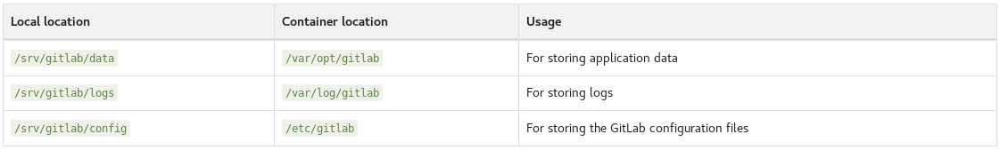

[Retour menu principal](../README.md)

## 2. Installation de base

Si vous n’avez pas installé docker-compose, procéder à l’installation de ce composant dans un 1er temps (https://docs.docker.com/compose/install/). 

Un fichier docker compose de base pour Gitlab Omnibus ressemble à l’image ci-dessous. Créez un fichier _**docker-compose.yml**_ : 

```yml
version: '3'
services:
  gitlab:
    image: 'gitlab/gitlab-ce:latest'
    restart: always
    container_name: gitlab
    hostname: 'gitlab.example.com'
    environment:
      GITLAB_OMNIBUS_CONFIG: |
        external_url 'http://gitlab.example.com'
        gitlab_rails['time_zone'] = 'Europe/Paris'
    ports:
      - '80:80'
      - '443:443'
      - '22:22'
    volumes:
      - /srv/gitlab/config:/etc/gitlab'
      - /srv/gitlab/logs:/var/log/gitlab'
      - /srv/gitlab/data:/var/opt/gitlab'  
```
Notez que dans cet exemple nous n’utilisons pas de connexion SSL/TLS pour notre site Gitlab mais nous verrons comment implémenter un certificat pour un accès sécurisé. 

Toutes les lignes contenues dans _**environment/GITLAB_OMNIBUS_CONFIG**_ permettent de préconfigurer le container Gitlab. Cette section peut contenir n’importe quelle configuration du fichier _**gitlab.rb**_ et ces instructions seront prises en compte avant de charger la configuration du fichier gitlab.rb du container. Il est donc très simple de configurer les composants du container contenues dans le fichier gitlab.rb (voir le template à : https://gitlab.com/gitlab-org/omnibus-gitlab/blob/master/files/gitlab-config-template/gitlab.rb.template). 

**Attention! Les instructions de GITLAB_OMNIBUS_CONFIG n’écrasent pas la configuration de gitlab.rb, elles sont simplement évaluées au chargement.**

Le mapping des volumes persistants sur gitlab fonctionne comme ceci:


Si vous avez **SELinux** d’activé, il faut modifier le fichier (en rajoutant l’option “:Z”) pour autoriser le process Docker à accéder aux ressources avec les bonnes permissions (https://docs.docker.com/storage/bind-mounts/): 
```yml
    volumes:
      - '/srv/gitlab/config:/etc/gitlab:Z' 
      - '/srv/gitlab/logs:/var/log/gitlab:Z'
      - '/srv/gitlab/data:/var/opt/gitlab:Z'
```
Rediriger les ports d'écoute classiques peut-être intéressant en fonction de la situation. Il est plus pratique d'utiliser un **fichier de variables (.env)** et de faire référence à ces variables dans notre fichier docker-compose. 

```bash
## Version control
DOCKER_REGISTRY=gitlab
IMAGE=gitlab-ce
VERSION=latest

## URLs
HOSTNAME=gitlab.example.com
EXT_URL=http://gitlab.example.com

## VOLUMES
MOUNT_PATH=/srv

## PORTS
HOST_SSH_PORT=2222
HOST_HTTP_PORT=2280
HOST_HTTPS_PORT=2443
```
Voici le fichier docker-compose pour réutiliser ces variables:
```yml
version: '3'
services:
  gitlab:
    image: '${DOCKER_REGISTRY}/${IMAGE}:${VERSION}'
    restart: always
    container_name: gitlab
    hostname: '${HOSTNAME}'
    environment:
      GITLAB_OMNIBUS_CONFIG: |
        external_url '${EXT_URL}'
        gitlab_rails['time_zone'] = 'Europe/Paris'
        gitlab_rails['gitlab_shell_ssh_port'] = ${HOST_SSH_PORT}
    ports:
      - '${HOST_HTTP_PORT}:80'
      - '${HOST_HTTPS_PORT}:443'
      - '${HOST_SSH_PORT}:22'
    volumes:
      - '${MOUNT_PATH}/gitlab/config:/etc/gitlab'
      - '${MOUNT_PATH}/gitlab/logs:/var/log/gitlab'
      - '${MOUNT_PATH}/gitlab/data:/var/opt/gitlab'  
```
---------------------------------------------------------------------------------------------------------------------------------

[Retour menu principal](../README.md)

[Suivant](03-Activer-SSL-TLS.md)
