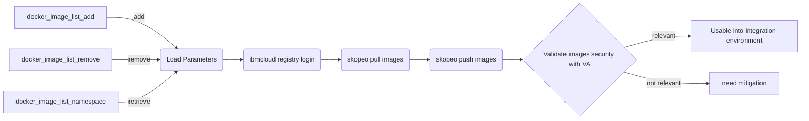

[Retour menu principal](../README.md)

## 9. Backup
### Overview

It is recommended to keep a copy of ```/etc/gitlab```, or at least of ```/etc/gitlab/gitlab-secrets.json```, in a safe place. If you ever need to restore a GitLab application backup you need to also restore ```gitlab-secrets.json```. If you do not, GitLab users who are using two-factor authentication will lose access to your GitLab server and ‘secure variables’ stored in GitLab CI will be lost.

It is not recommended to store your configuration backup in the same place as your application data backup, see below.

All configuration for Omnibus GitLab is stored in ```/etc/gitlab```. To backup your configuration, just run ```sudo gitlab-ctl backup-etc```. It will create a tar archive in /etc/gitlab/config_backup/. Directory and backup files will be readable only to root.

### Process

To backup **application data** and **configuration data** from your gitlab docker instance, you have several way to do so. Here is an example of how you can do it.

To backup **application data** from a docker container, you need to execute following command:

```
docker exec -t <your container name> gitlab-backup
```
By default, application data backup will be stored in ```/var/opt/gitlab``` as a **tar** file.

To backup **configuration data** from a docker container, you need to execute following command:

```
docker exec -t <your container name> /bin/sh -c 'umask 0077; tar cfz /secret/gitlab/backups/$(date "+etc-gitlab-\%s.tgz") -C / etc/gitlab'
```
By default, configuration data backup will be stored in ```/secret/gitlab/backups``` as a **tgz** file.

N.B: Note that if you want to have these backups persisted, outside the container, you need to mount volumes to ```/secret/gitlab/backups``` and ```/var/opt/gitlab``` 

You can also configuration manually the location of **application data** location in your container with the following ```gitlab_rails``` line:

```yaml
gitlab_rails['backup_path'] = '/mnt/backups'
```

You may want to set a limited lifetime for backups to prevent regular backups using all your disk space in your container. 

```yaml
gitlab_rails['backup_keep_time'] = 604800
```

in the end, you can modify you ```docker-compose.yaml``` file to add the following lines:

```yaml
environment:
      GITLAB_OMNIBUS_CONFIG: |
        gitlab_rails['backup_path'] = '/mnt/backups'
        gitlab_rails['backup_keep_time'] = 604800       # optional if you keep backups inside cointainer only
volumes:
      - '${BACKUP_PATH}/app:/mnt/backups'
      - '${BACKUP_PATH}/secret:/secret/gitlab/backups'
```

### Automating backup

To automate your backup process, you have 2 major options.

- Automate process **inside container**
- Automate process on the **host**

In this case we choose to automate process on the host to have better control over files location, permissions and backup rotation. We need to use bash script and crontab to make this working properly.

You can find a script to run on your host machine here [backup script](../scripts/backup-script.sh)

This script do the following:

- create **application data** backup in gitlab specified directory
- create **configuration data** backup in gitlab specified directory
- move application & configuration backups from initial directory to another directory
- change ownership of these backups
- delete backups older than a specified amount of time




Pour restaurer, suivre cette procédure:
```bash
# Renommer l'existant /etc/gitlab
sudo mv /etc/gitlab /etc/gitlab.$(date +%s)
sudo tar -xf gitlab_config_1487687824_2017_02_21.tar -C /
```
Penser à exécuter cette commande après la restauration d'une configuration backup:
```bash
 sudo gitlab-ctl reconfigure
```
Les SSh host keys de la machine sont stockées dans un répertoire différent _**'/etc/ssh'**_. Assurez-vous d'aussi restaurer ces clefs pour éviter des attaques de type man-in-the-middle.

### Backup applicatif
Pour créer un backup des repos et des metadatas Gitlab, suivre la documentation sur ce lien:

https://docs.gitlab.com/ee/raketasks/backup_restore.html#creating-a-backup-of-the-gitlab-system

Les backups seront stockés dans _**'/var/opt/gitlab/backups'**_.

Si vous souhaitez sstocker les backups Gitlab dans un répertoire différent, ajoutez le paramètre suivant à _**'/etc/gitlab/gitlab.rb'**_ et exécutez **sudo gitlab-ctl reconfigure**:
```bash
gitlab_rails['backup_path'] = '/mnt/backups'
```

-----------------------------------------------------------------------------------------------------------------------------------

[Retour menu principal](../README.md)

[Suivant](10-Installation-process.md)