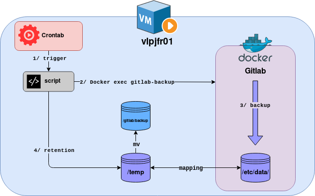
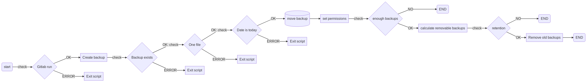

[Retour menu principal](../README.md)

## 9. Backup
### Overview

It is recommended to keep a copy of ```/etc/gitlab```, or at least of ```/etc/gitlab/gitlab-secrets.json```, in a safe place. ```/etc/gitlab/gitlab-secrets.json``` file contains the **database encryption key**, **CI/CD variables**, and variables used for **two-factor authentication**. If you fail to restore this encryption key file along with the application data backup, users with two-factor authentication enabled and GitLab Runners will lose access to your GitLab server.

It is not recommended to store your configuration backup in the same place as your application data backup, see below.

All configuration for Omnibus GitLab is stored in ```/etc/gitlab```. To backup your configuration, just run ```sudo gitlab-ctl backup-etc```. It will create a tar archive in /etc/gitlab/config_backup/. Directory and backup files will be readable only to root.

### Process

To backup **application data** and **configuration data** from your gitlab docker instance, you have several way to do so. Here is an example of how you can do it.

To backup **application data** from a docker container, you need to execute following command:

```
docker exec -t <your container name> gitlab-backup
```
By default, application data backup will be stored in ```/var/opt/gitlab``` as a **tar** file.

To backup **configuration data** from a docker container, you need to execute following command:

```
docker exec -t <your container name> /bin/sh -c 'umask 0077; tar cfz /secret/gitlab/backups/$(date "+etc-gitlab-\%s.tgz") -C / etc/gitlab'
```
By default, configuration data backup will be stored in ```/secret/gitlab/backups``` as a **tgz** file.

N.B: Note that if you want to have these backups persisted, outside the container, you need to mount volumes to ```/secret/gitlab/backups``` and ```/var/opt/gitlab``` 

You can also configuration manually the location of **application data** location in your container with the following ```gitlab_rails``` line:

```yaml
gitlab_rails['backup_path'] = '/mnt/backups'
```

You may want to set a limited lifetime for backups to prevent regular backups using all your disk space in your container. 

```yaml
gitlab_rails['backup_keep_time'] = 604800
```

in the end, you can modify you ```docker-compose.yaml``` file to add the following lines:

```yaml
environment:
      GITLAB_OMNIBUS_CONFIG: |
        gitlab_rails['backup_path'] = '/mnt/backups'
        gitlab_rails['backup_keep_time'] = 604800       # optional if you keep backups inside cointainer only
volumes:
      - '${BACKUP_PATH}/app:/mnt/backups'
      - '${BACKUP_PATH}/secret:/secret/gitlab/backups'
```

### Automating backup

To automate your backup process, you have 2 major options.

- Automate process **inside container**
- Automate process on the **host**

In this case we choose to automate process on the host to have better control over files location, permissions and backup retention. We need to use **bash script** and **crontab** to make this working properly.

You can find a script to run on your host machine here [backup script](../scripts/backup-script.sh)

To explain how this script is working, refer to the following diagrams:

<p align="center">
  
</p>

This picture describes how the script is triggered by crontab on the VM and what actions are realized. To get a more detailed view over what is done by the script, please reger to the following flow diagram:

<p align="center">
  
</p>


### Restore

This procedure assumes that:

 - You have installed the **exact same version and type (CE/EE)** of GitLab Omnibus with which the backup was created.
 - You have run ```sudo gitlab-ctl reconfigure``` at least once.
 - GitLab is running. If not, start it using ```sudo gitlab-ctl start```.

First make sure your backup tar file is in the backup directory described in the ```gitlab.rb``` configuration ```gitlab_rails['backup_path']```. The default is ```/var/opt/gitlab/backups```. It needs to be owned by the ```git``` user.

for example:

```
sudo cp 11493107454_2018_04_25_10.6.4-ce_gitlab_backup.tar /var/opt/gitlab/backups/
sudo chown git.git /var/opt/gitlab/backups/11493107454_2018_04_25_10.6.4-ce_gitlab_backup.tar
```

Stop the processes that are connected to the database. Leave the rest of GitLab running:

```
sudo gitlab-ctl stop unicorn
sudo gitlab-ctl stop puma
sudo gitlab-ctl stop sidekiq
# Verify
sudo gitlab-ctl status
```

Next, restore the backup, specifying the timestamp of the backup you wish to restore:

```
# This command will overwrite the contents of your GitLab database!
sudo gitlab-backup restore BACKUP=1493107454_2018_04_25_10.6.4-ce
```

Next, restore ```/etc/gitlab/gitlab-secrets.json``` if necessary as mentioned above.

Reconfigure, restart and check GitLab:

```
sudo gitlab-ctl reconfigure
sudo gitlab-ctl restart
sudo gitlab-rake gitlab:check SANITIZE=true
```


-----------------------------------------------------------------------------------------------------------------------------------

[Retour menu principal](../README.md)

[Suivant](10-Installation-process.md)