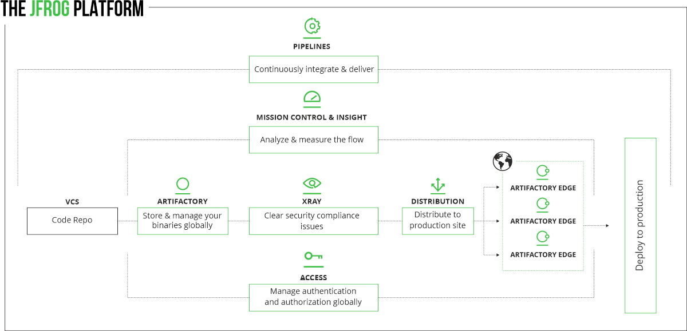

[Main menu](../README.md)

## 1. Introduction

Jfrog offers a solution called Jfrog Platform composed of several DevOps tools.

- JFrog Artifactory
- JFrog Artifactory Edge
- JFrog Xray
- JFrog Mission Control
- JFrog Distribution
- JFrog Pipelines

  

The commercial offer is split in different versions:

  

  

The JFrog Platform Deployment (JPD) defines a single logical unit shared by all JFrog products. It must be comprised of one JFrog Artifactory service (standalone or HA) and optional additional external services. The below diagram represents a complete JPD containing all services in the JFrog Enterprise+ platform.

Each service should be installed separately according to the installation guide.

  

Each JFrog product can be deployed with 1 or more nodes. Each node has its microservices and a local router (service discovery and API gateway). All microservices of the same product are deployed on the same node/host.
The JFrog Artifactory service contains the following microservices:

- **Artifactory** - The application server
- **Router** - The central hub for communication between all the microservices, and cross-product.
- **Access** - The authentication server and service registry. Used to manage Users, Groups, Permissions and Access Tokens for all products in the JPD
- **Frontend** - The application user interface (UI for the entire JPD)
- **Metadata** - The Components metadata server. Serves the Packages screen in the JPD UI. 
- **Replicator** - The replication engine (available with an Enterprise+ license)

Additional external JFrog services are:

- **Xray**
- **Mission Control**
- **Distribution**
- **Pipelines**

Outside the JPD:

- **Load Balancer** - The entry point to the unit, should be set up by the customer and to communicate with  Artifactory and Artifactory's Router service (as demonstrated in the diagram above).
- **Browser / JFrog CLI / Other Clients** - External client(s) that interact with JFrog products in the JPD. Set up to only communicate with the LB.

This procedure is focused on Jfrog Artifactory installation on **Docker** environment and especially with **docker-compose** file.

Here you can find official Jfrog documentation:

https://www.jfrog.com/confluence/display/JFROG/JFrog+Documentation

some other useful links for installation binaries:

https://bintray.com/jfrog

https://bintray.com/jfrog/artifactory

https://bintray.com/jfrog/artifactory-pro

---------------------------------------------------------------------------------------------------------------------------------

[Main menu](../README.md)

[Next](02-Prerequis.md)

