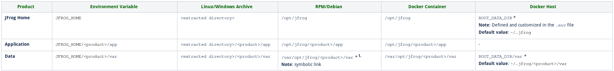
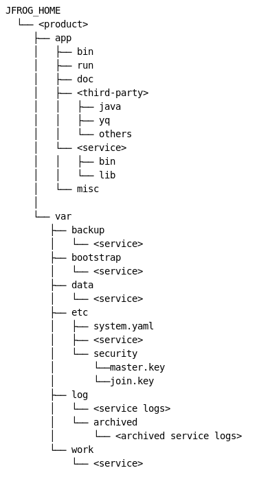
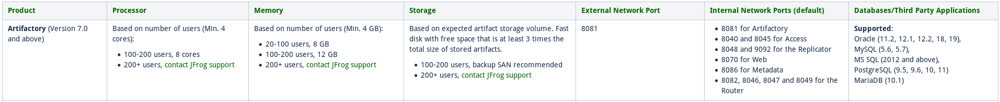

[Retour menu principal](../README.md)

## 2. Prérequis

Voici la structure des répertoires de JFrog:



"*" : signigie que les répertoires sont personnalisables. 


Le layout classique des répertoires pour tous les produits JFrog ressemble à ça:



Les plateformes supportées sont les suivantes:

- Linux
  - Debian 8.x ou 9.x
  - CentOS / RHEL 6.x ou 7.x
  - Ubuntu 16.04 ou 18.04
- Windows Server 2008R2, 2016 ou 2019

Pour le produit Artifactory, les recommandations minimales sont les suivantes:



Pour les installations Docker et Docker-Compose, JFrog nécessite **Docker v18** et **Docker-Compose v1.24**.

JFrog fournit une manière flexible de configurer votre système en utilisant une simple fichier yaml ```system.yaml``` situé dans le répertoire ```$JFROG_HOME/<product>/var/etc``` de chaque produit. Ce fichier permet de contrôler plusieurs aspects comme les ressources, la sécurité, les BDD etc...
Toutes les configurations possibles sont disponibles dans le fichier yaml template disponible dans le répertoire ```$JFROG_HOME/<product>/var/etc/```.

Pour le produit **Artifactory**, consulter les deux templates suivants:

- ```system.basic-template.yaml```
- ```system.full-template.yaml``` 

situés dans le dossier ```$JFROG_HOME/artifactory/var/etc/```.

---------------------------------------------------------------------------------------------------------------------------------

[Retour menu principal](../README.md)

[Suivant](03-Installation-version-free.md)
