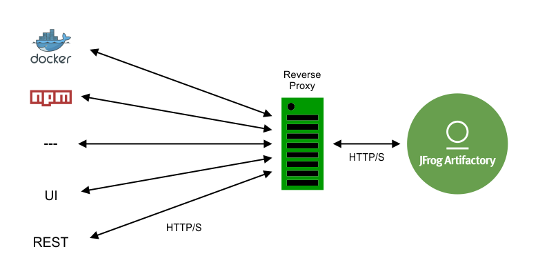
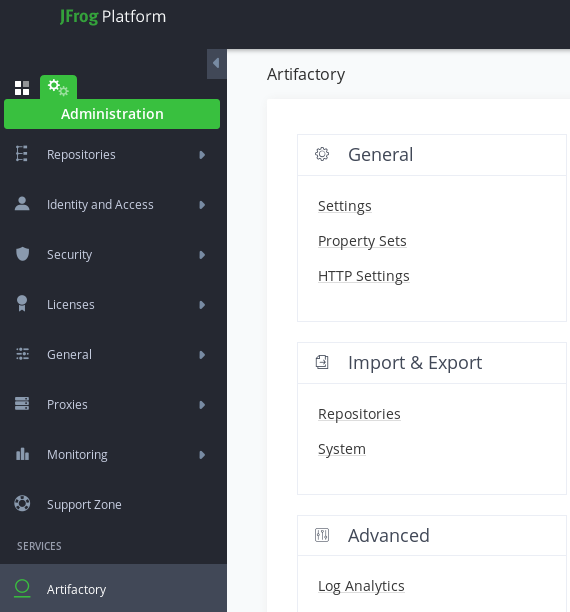
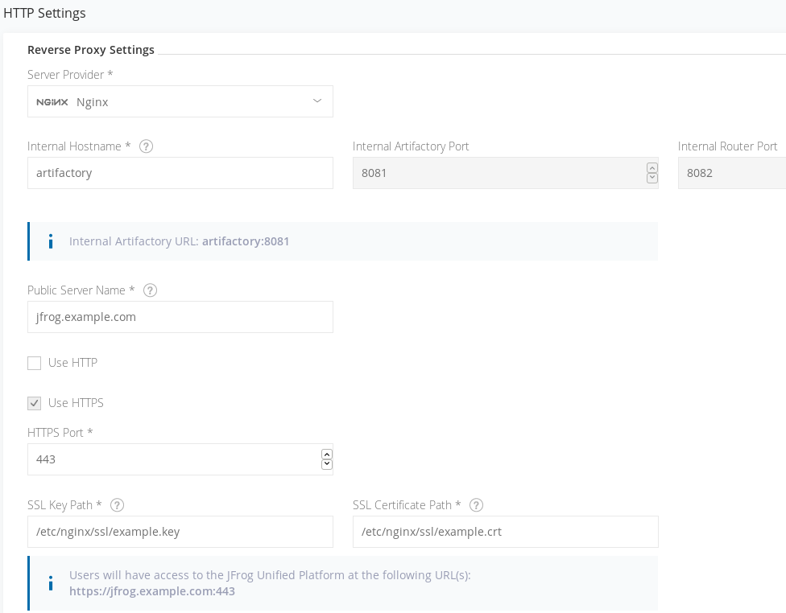

[Main menu](../README.md)

## 4. Installation from Docker-Compose (version Pro)

You can find Jfrog Artifactory packages for docker-compose on the following link :

- https://bintray.com/jfrog/artifactory-pro
- https://bintray.com/jfrog/reg2/jfrog%3Aartifactory-pro

Documentation for installation is available here :

- https://www.jfrog.com/confluence/display/JFROG/Installing+Artifactory
- https://www.jfrog.com/confluence/display/JFROG/Installing+Artifactory#InstallingArtifactory-ProductConfiguration

Installation for **PRO version** is identical to the **Free version**. Follow the same directions as **Free version**, but you can also add a NGINX Reverse Proxy :



If you want both NGINX Reverse Proxy and PostgreSQL BDD, you can combine both ```docker-compose-nginx.yaml``` and ```docker-compose-postgres.yaml``` files from the template directory :

```diff
 artifactory-pro-7.2.1/
 ├── bin
 │   ├── dockerComposeHelper.sh
 │   ├── migrate.sh
 │   ├── migrationComposeInfo.yaml
 │   ├── systemDiagnostics.sh
 │   └── systemYamlHelper.sh
 ├── config.sh
+├── docker-compose.yaml 
 ├── .env
 ├── README.md
 ├── templates
-│   ├── docker-compose-nginx.yaml
-│   ├── docker-compose-postgres.yaml
 │   ├── docker-compose.yaml
 │   ├── system.basic-template.yaml
 │   └── system.full-template.yaml
 └── third-party
     ├── logrotate
     └── yq
```

Combined docker-compose file is available here : [combined docker-compose.yaml (Postegre and NGINX)](../ressources/docker-compose.yaml)

Don't forget to update ```.env``` file accordingly by adding the **HOME** path of your Jfrog installation :

```yml
ROOT_DATA_DIR=/root/.jfrog/artifactory
```

You can also download ```.env``` file provided here [.env file (modified)](../ressources/.env)

And finaly, launch docker-compose:

```shell
docker-compose up -d
```

```console
[root@workstation ~ ]$ docker ps
CONTAINER ID        IMAGE                                                 COMMAND                  CREATED             STATUS              PORTS                                                     NAMES
c06f2aaad83f        docker.bintray.io/jfrog/nginx-artifactory-pro:7.4.3   "/entrypoint-nginx.sh"   4 seconds ago       Up 3 seconds                                                                  nginxjfrog
a1904ddc5a52        docker.bintray.io/jfrog/artifactory-pro:7.4.3         "/entrypoint-artifac…"   5 seconds ago       Up 4 seconds        0.0.0.0:8081-8082->8081-8082/tcp, 0.0.0.0:3443->443/tcp   artifactory
4389ccdeb819        docker.bintray.io/postgres:9.6.11                     "docker-entrypoint.s…"   5 seconds ago       Up 4 seconds        0.0.0.0:5432->5432/tcp                                    postgresqljfrog
```

NGINX directory is as follow :

```console
nginx/
├── conf.d
│   └── artifactory.conf
├── logs
│   ├── access.log
│   └── error.log
└── ssl
    ├── example.crt
    └── example.key
```

Certificate and key are automatically created but you can remplace it with your own. Configuration can be modified through ```artifactory.conf``` file.

Once containers are up and running, you need to modify the NGINX configuration. By default, NGINX configuration is located in ```$JFROG_HOME/var/data/nginx/conf.d``` :

```diff
 ssl_protocols TLSv1 TLSv1.1 TLSv1.2 TLSv1.3;
 ssl_certificate  /var/opt/jfrog/nginx/ssl/example.crt;
 ssl_certificate_key  /var/opt/jfrog/nginx/ssl/example.key;
 ssl_session_cache shared:SSL:1m;
 ssl_prefer_server_ciphers   on;
 ## server configuration
 server {
   listen 443 ssl;
   listen 80 ;
   server_name ~(?<repo>.+)\.artifactory artifactory;

   if ($http_x_forwarded_proto = '') {
     set $http_x_forwarded_proto  $scheme;
   }
   ## Application specific logs
   ## access_log /var/log/nginx/artifactory-access.log timing;
   ## error_log /var/log/nginx/artifactory-error.log;
   if ( $repo != "" ){
     rewrite ^/(v1|v2)/(.*) /artifactory/api/docker/$repo/$1/$2;
   }
   chunked_transfer_encoding on;
   client_max_body_size 0;
   location / {
     proxy_read_timeout  900;
     proxy_pass_header   Server;
     proxy_cookie_path   ~*^/.* /;
+    proxy_pass          http://localhost:8082;
     proxy_set_header    X-JFrog-Override-Base-Url $http_x_forwarded_proto://$host:$server_port;
     proxy_set_header    X-Forwarded-Port  $server_port;
     proxy_set_header    X-Forwarded-Proto $http_x_forwarded_proto;
     proxy_set_header    Host              $http_host;
     proxy_set_header    X-Forwarded-For   $proxy_add_x_forwarded_for;
     location ~ ^/artifactory/ {
+        proxy_pass    http://localhost:8081;
     }
   }
 }
```

You need to replace following lines :

- location / { proxy_pass     http://localhost:8082; }
- location ~ ^/artifactory/ { proxy_pass     http://localhost:8082; }

By replacing ```localhost``` by the actual container name of Jfrog artifactory (in our case ```artifactory```). 

Then execute ```docker-compose stop``` and ```docker-compose start```. You can modify configuration file as needed.
**CAUTION !!** executing ```docker-compose restart``` is prone to failure, so stick with stop and start.

You can also automatically generate NGINX configuration file thanks to the Jfrog WEB UI. Connect on Jfrog Artifactory UI and navigate to **Administration** menu, **Artifactory** section, **General/HTTP Settings** parameter .

<p align="center">
  
</p>

Configure NGINX Reverse Proxy as you want and check the configuration file.

<p align="center">
  
</p>

You can now copy/paste configuration file in the ```$JFROG_HOME/var/data/nginx/conf.d``` directory and stop and start the instance.

### HealthCheck

You can also configure HealthCheck for NGINX ReverseProxy. The thing we want to check is that Artifactory API is actually available through NGINX Reverse Proxy. To check this, you can add the following lines :

```yaml
    healthcheck:
      test: ["CMD", "curl", "-kf", "https://localhost:443/artifactory/api/system/ping"]
      interval: 30s
      timeout: 5s
      retries: 5
```

This check will set the container as unhealthy if the connection to Artifactory API is unavailable. Keep in mind that if Artifactory fails, then NGINX will also fail. But there is no need to check that the NGINX process is working properly.

You can verify healthcheck status with the following commands :

```
docker inspect --format "{{json .State.Health }}" <CONTAINER-NAME> | jq
docker inspect --format "{{json .State.Health }}" <CONTAINER-NAME> | jq '.Log[].Output'
```


---------------------------------------------------------------------------------------------------------------------------------

[Main menu](../README.md)

[Next](05-LDAP-settings.md)
