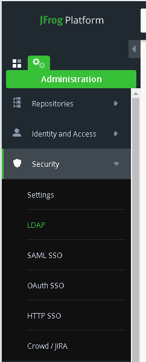
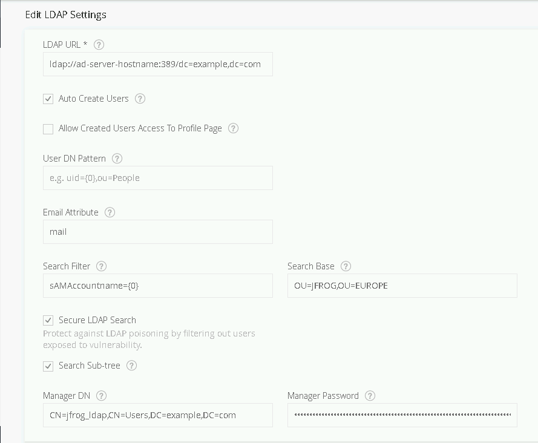
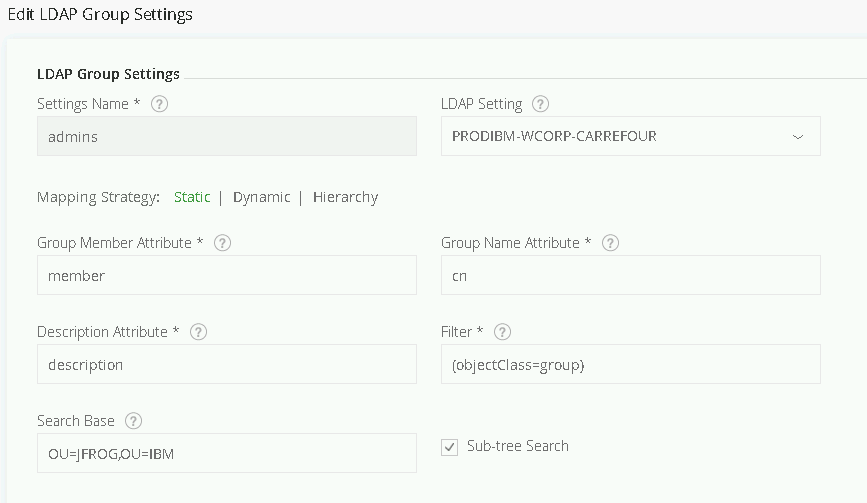
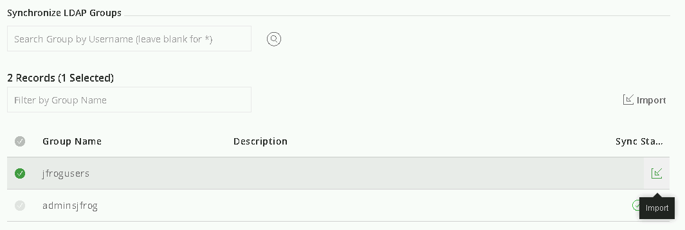

[Main menu](../README.md)

## 5. LDAP configuration

You can find LDAP settings information through these links:

- https://www.jfrog.com/confluence/display/RTF6X/LDAP+Groups

- https://jfrog.com/knowledge-base/how-does-ldap-ad-group-sync-mapping-work/

- https://jfrog.com/screencast/configure-artifactory-with-ldap/

In order to synchronize LDAP authentication with JFrog, you need to log in to the JFrog WEB UI as local admin and naviguate to admin tab, security menu and LDAP configuration:

<p align="center">
  
</p>

Create a new LDAP setting by clicking on ```New LDAP Setting```. Now you need to fill information regarding your actual LDAP configuration. For example:

```console
LDAP URL: ldap://ad-server-hostname:port/dc=example,dc=com
```
Use a ```Search Filter``` for Active Directory as per below:

either ```sAMAccountname={0}``` or ```(&(objectClass=user)(cn=*))``` can work as well. In ```Search Base``` you need to put the OU where Jfrog need to look after users, for example:

```console
Search Base: OU=JFROG,OU=EUROPE
```
And finally, you need to add a Manager account DN to allow ldapsearch:

```console
Manager DN: CN=Jfrog_ldap,CN=Users,DC=example,DC=com
```

<p align="center">
  
</p>

You can also specify LDAP group synchronisation with JFrog instance. Under LDAP menu, hit the New LDAP Group Setting button and fill the information as per below:

<p align="center">
  
</p>

You can then search for groups by cliking on the synchronization LDAP Groups magnifying glass. Select the groups you want and click on the import button:

<p align="center">
  
</p>

Then save.

In the ```Identity and Access``` menu, you should see the imported group under ```Groups``` tab. You can now try to login with a user from this group, it should work properly.

---------------------------------------------------------------------------------------------------------------------------------

[Main menu](../README.md)

[Next](06-Create-and-use-repo.md)
