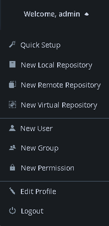
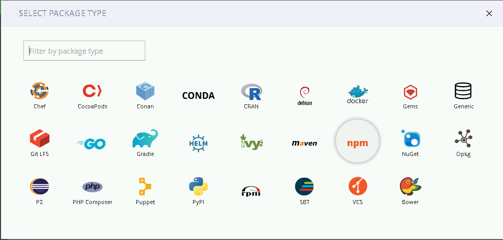
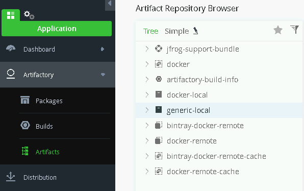
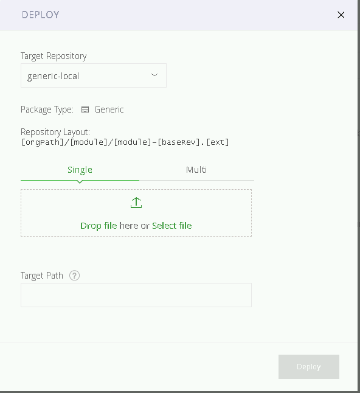
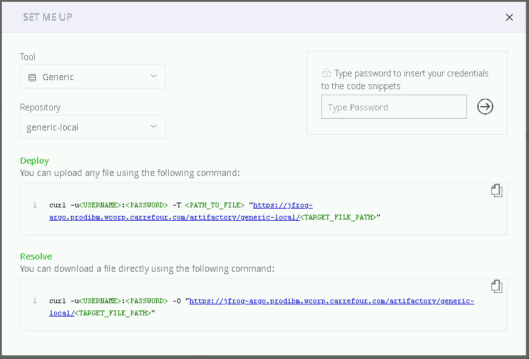

[Main menu](../README.md)

## 6. Create and use repo

You can create new repository from the user tab:

<p align="center">
  
</p>

And then select the type:

<p align="center">
  
</p>

Once done, you can check your repositories in the ```Artifactory/Artifacts``` menu and then display artifactory browser:

<p align="center">
  
</p>

To deploy a file to a repository, just select the desired repository and click ```Deploy``` in the top-right corner. You can then drag&drop files or browse your folders to select a file:

<p align="center">
  
</p>

If you prefer to use CLI, click on ```Set Me Up``` instead of ```Deploy``` to get instructions on how to push files via CLI:

<p align="center">
  
</p>

To upload a file, use the following command:

```bash
curl -u <USERNAME>:<PASSWORD> -T <PATH_TO_FILE> "https://JFROG-FQDN:<PORT>/artifactory/<YOUR-REPO>/<TARGET_FILE_PATH>"
```

To download a file, use the following command:

```bash
curl -u <USERNAME>:<PASSWORD> -O "https://JFROG-FQDN:<PORT>/artifactory/<YOUR-REPO>/<TARGET_FILE_PATH>"
```
Files from repositories are stored in the ```${JFROG_HOME}/var/data/artifactory/filestore``` directory.

**CAUTION !!** If you need to open access to your Jfrog server, please keep in mind that you should open ports for the Nginx proxy and API access as well (443 and 8081) to have a backup solution to download artefacts in case your proxy is down.

---------------------------------------------------------------------------------------------------------------------------------

[Main menu](../README.md)

[Next](07-Using-API.md)
