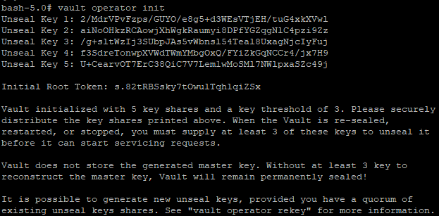
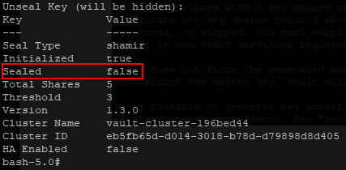

# Running Vault server
Inside the container, run this command:
```bash
vault operator init
```
You should get keys like that:




Use 3 keys to unseal your vault server with this command (repeated 3 times) :
```bash
vault operator unseal
```
Once done, you should see the sealed line as false :


