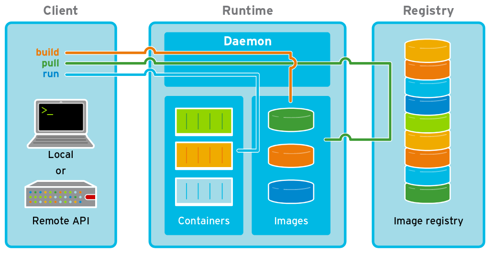

[Retour menu principal](../README.md)

# Docker manual
## Docker architecture

<p align="center">
  
</p>

## Commands
### Containers
#### Lifecycle

- ```docker create``` creates a container but does not start it.
- ```docker rename``` allows the container to be renamed.
- ```docker run``` creates and starts a container in one operation.
- ```docker rm``` deletes a container.
- ```docker update``` updates a container's resource limits.

#### Starting and stopping

- ```docker start``` starts a container so it is running.
- ```docker stop``` stops a running container.
- ```docker restart``` stops and starts a container.
- ```docker pause``` pauses a running container, "freezing" it in place.
- ```docker unpause``` will unpause a running container.
- ```docker wait``` blocks until running container stops.
- ```docker kill``` sends a SIGKILL to a running container.
- ```docker attach``` will connect to a running container.

#### Info

- ```docker ps``` shows running containers.
- ```docker logs``` gets logs from container. (You can use a custom log driver, but logs is only available for json-file and journald in 1.10).
- ```docker inspect``` looks at all the info on a container (including IP address).
- ```docker events``` gets events from container.
- ```docker port``` shows public facing port of container.
- ```docker top``` shows running processes in container.
- ```docker stats``` shows containers' resource usage statistics.
- ```docker diff``` shows changed files in the container's FS.

#### Import/Export

- ```docker cp``` copies files or folders between a container and the local filesystem.
- ```docker export``` turns container filesystem into tarball archive stream to STDOUT.

#### Executing commands

- ```docker exec``` to execute a command in container.

### Images
#### Lifecycle

- ```docker images``` shows all images.
- ```docker import``` creates an image from a tarball.
- ```docker build``` creates image from Dockerfile.
- ```docker commit``` creates image from a container, pausing it temporarily if it is running.
- ```docker rmi``` removes an image.
- ```docker load``` loads an image from a tar archive as STDIN, including images and tags (as of 0.7).
- ```docker save``` saves an image to a tar archive stream to STDOUT with all parent layers, tags & versions (as of 0.7).

#### Info

- ```docker history``` shows history of image.
- ```docker tag``` tags an image to a name (local or registry).

### Networks
#### Lifecycle

- ```docker network create```
- ```docker network rm```

#### Info 

- ```docker network ls```
- ```docker network inspect```

#### Connection

- ```docker network connect```
- ```docker network disconnect```

### Registry and repository

- ```docker login``` to login to a registry.
- ```docker logout``` to logout from a registry.
- ```docker search``` searches registry for image.
- ```docker pull``` pulls an image from registry to local machine.
- ```docker push``` pushes an image to the registry from local machine.

### Volumes
#### Lifecycle

- ```docker volume create```
- ```docker volume rm```

#### Info

- ```docker volume ls```
- ```docker volume inspect```

### Tips
#### Prune

- ```docker system prune```
- ```docker volume prune```
- ```docker network prune```
- ```docker container prune```
- ```docker image prune```

#### df

```docker system df``` presents a summary of the space currently used by different docker objects.

### DOCKERFILE

* [.dockerignore](https://docs.docker.com/engine/reference/builder/#dockerignore-file)
* [FROM](https://docs.docker.com/engine/reference/builder/#from) Sets the Base Image for subsequent instructions.
* [MAINTAINER (deprecated - use LABEL instead)](https://docs.docker.com/engine/reference/builder/#maintainer-deprecated) Set the Author field of the generated images.
* [RUN](https://docs.docker.com/engine/reference/builder/#run) execute any commands in a new layer on top of the current image and commit the results.
* [CMD](https://docs.docker.com/engine/reference/builder/#cmd) provide defaults for an executing container.
* [EXPOSE](https://docs.docker.com/engine/reference/builder/#expose) informs Docker that the container listens on the specified network ports at runtime.  NOTE: does not actually make ports accessible.
* [ENV](https://docs.docker.com/engine/reference/builder/#env) sets environment variable.
* [ADD](https://docs.docker.com/engine/reference/builder/#add) copies new files, directories or remote file to container.  Invalidates caches. Avoid `ADD` and use `COPY` instead.
* [COPY](https://docs.docker.com/engine/reference/builder/#copy) copies new files or directories to container.  By default this copies as root regardless of the USER/WORKDIR settings.  Use `--chown=<user>:<group>` to give ownership to another user/group.  (Same for `ADD`.)
* [ENTRYPOINT](https://docs.docker.com/engine/reference/builder/#entrypoint) configures a container that will run as an executable.
* [VOLUME](https://docs.docker.com/engine/reference/builder/#volume) creates a mount point for externally mounted volumes or other containers.
* [USER](https://docs.docker.com/engine/reference/builder/#user) sets the user name for following RUN / CMD / ENTRYPOINT commands.
* [WORKDIR](https://docs.docker.com/engine/reference/builder/#workdir) sets the working directory.
* [ARG](https://docs.docker.com/engine/reference/builder/#arg) defines a build-time variable.
* [ONBUILD](https://docs.docker.com/engine/reference/builder/#onbuild) adds a trigger instruction when the image is used as the base for another build.
* [STOPSIGNAL](https://docs.docker.com/engine/reference/builder/#stopsignal) sets the system call signal that will be sent to the container to exit.
* [LABEL](https://docs.docker.com/config/labels-custom-metadata/) apply key/value metadata to your images, containers, or daemons.
* [SHELL](https://docs.docker.com/engine/reference/builder/#shell) override default shell is used by docker to run commands.
* [HEALTHCHECK](https://docs.docker.com/engine/reference/builder/#healthcheck) tells docker how to test a container to check that it is still working.

## CLI cheat sheet
### RUN

```bash
docker run -it rhel7/rhel bash                                                   # run a bash shell inside an image
docker run --name mywildfly -d -p 8080:8080 jboss/wildfly                        # run a container in detached mode with mapping port 8080

docker network create mynetwork \                                                # Run a detached container in a previously created container network
&& docker run --name mywildfly-net -d --net mynetwork \
-p 8080:8080 jboss/wildfly

docker run --name mywildfly-volume -d \                                          # Run a detached container mounting a local folder inside the container
-v myfolder/:/opt/jboss/wildfly/standalone/deployments/ \
-p 8080:8080 jboss/wildflyjboss/wildfly
```

### BUILD

```bash
docker build -t <username>/<image-name>:<tag> <dockerfile-path>                      # build an image
docker build -t myimage:latest .                                                 # build an image using the Dockerfile in the current directory
```

### LOGS

```bash
docker logs -f [container-name|container-id]                                     # Follow the logs of a specific container
docker logs --details [container-name|container-id]                              # display logs details about container
```

### LIST

```bash
docker ps                                                                        # list active containers
docker ps -a                                                                     # list all containers
docker volume ls                                                                 # list volumes
docker image ls                                                                  # list images
docker image ls -a                                                               # list images and intermediates
docker network ls                                                                # list networks
```

### STOP

```bash
docker stop [container-name|container-id]                                        # stop a container
docker stop -t1                                                                  # stop a container (timeout = 1sec)
docker stop $(docker ps)                                                         # stop (properly) all running containers
docker kill $(docker ps)                                                         # kill all running containers
```

### REMOVE

```bash
docker rm [container-name|container-id]                                          # remove a stopped container
docker rm -f [container-name|container-id]                                       # force stop and remove a container
docker rm $(docker ps)                                                           # remove all running containers
docker rm $(docker ps -a)                                                        # remove all containers
docker rmi [username/]<image-name>[:tag]                                         # remove an image
docker rmi $(docker images -a)                                                   # remove all images
docker volume prune                                                              # remove unused volumes
docker system prune -a                                                           # remove all images, networks, builds and containers
```

### REGISTRY

```bash
docker tag jboss/wildfly myimage:v1                                              # Creates image "myimage:v1" for the image jboss/wildfly:latest
docker tag <image-name> <new-image-name>                                         # Creates a new image with the latest tag
docker tag <image-name>:<tag> <username>/<new-image-name>:<new-tag>              # Creates new image specifying new tag from existing image and tag
docker push <registry>/<username>/<image-name>:<tag>                             # push an image to a registry
docker pull <registry>/<username>/<image-name>:<tag>                             # pull an image from a registry
```

### ARCHIVE

```bash
docker save -o <pathToGeneratedFile>.tar <imageName>                             # Export the image to an external tar file
docker load -i <filename>.tar                                                    # Import an image from an external tar file
```

### BONUS

```bash
docker inspect -f "{{ .Mounts }}" <containerId>                                  # display all mapped volumes in a container
docker inspect -f '{{ (index .Mounts 0).Source }}' <containerId>                 # display path of 1st volume on host
docker inspect -f '{{ json .Mounts }}' <containerId> | jq                        # display all mapped volumes in a container as json format with jq output
```

More informations on : 

- https://github.com/wsargent/docker-cheat-sheet


---------------------------------------------------------------------------------------------------------------------------------

[Retour menu principal](../README.md)