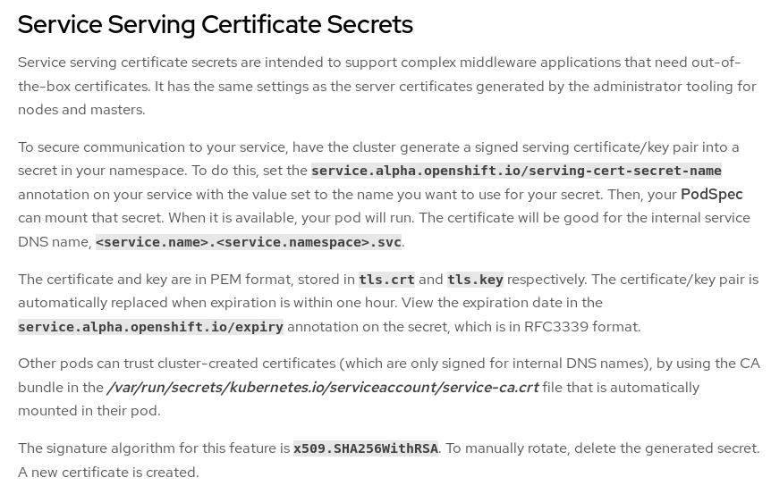

[Retour menu principal](../README.md)

## 1. Standalone install in Offline environment

### 1.1 Preparation: Docker image

In order to work in an offline environment, you need to pull&push docker images to the internal OpenShift registry.

First pull ```Vault``` image to local registry. Let's work with 1.3.2 version.

The form will be as follow : 
- ```docker pull <image>:<version>```

```console
[root@workstation ~ ]$ docker pull vault:1.3.2
1.3.2: Pulling from library/vault
4167d3e14976: Pull complete 
a4e1345c4d7f: Pull complete 
3bb275042a3c: Pull complete 
4d0eb2e7b022: Pull complete 
23e88cf23151: Pull complete 
Digest: sha256:cf9d54f9a5ead66076066e208dbdca2094531036d4b053c596341cefb17ebf95
Status: Downloaded newer image for vault:1.3.2
docker.io/library/vault:1.3.2
```
Now you need to push the image inside OpenShift local registry. For this purpose you need to tag it properly. In order to find the **public registry tag** to push your image. 

The form will be as follow : 
- ```docker tag <image> <OCP-PUBLIC-REGISTRY-URL>/<namespace/project>/<image>:<version>```

```console
[root@workstation ~ ]$ docker tag vault:1.3.2 default-route-openshift-image-registry.apps.ocp4-dev5.devibm.local/hashicorp/vault:1.3.2
```

Once done, login to your OpenShift cluster. You can find information about your cluster API address in the about section of the OpenShift WEB console.

The form will be as follow : 
- ```oc login --insecure-skip-tls-verify=true https://<OCP-API-ADDRESS> -u <username> -p <password>```

```console
[root@workstation ~ ]$ oc login --insecure-skip-tls-verify=true https://api.ocp4-dev5.devibm.local:6443 -u kubeadmin -p <password>
Login successful.

You have access to 61 projects, the list has been suppressed. You can list all projects with 'oc projects'

Using project "default".
```

And login to the internal registry.

The form will be as follow : 
- ```docker login -u kubeadmin -p $(oc whoami -t) <OCP-PUBLIC-REGISTRY-URL>```

```console
[root@workstation ~ ]$ docker login -u kubeadmin -p $(oc whoami -t) default-route-openshift-image-registry.apps.ocp4-dev5.devibm.local
Login Succeeded
```
First create your OCP project (equivalent to kubernetes namespace).

The form will be as follow : 
- ```oc create project <project-name>```

```console
[root@workstation ~ ]$ oc create project hashicorp
```
_**N.B: If you change the name of your project from "hashicorp" to something else, you will need to modify yaml files accordingly.**_

And now you can finally push your image.

The form will be as follow : 
- ```docker push <OCP-PUBLIC-REGISTRY-URL>/<namespace/project>/<image>:<version>```

```console
[root@workstation ~ ]$ docker push default-route-openshift-image-registry.apps.ocp4-dev5.devibm.local/hashicorp/vault:1.3.2
The push refers to repository [default-route-openshift-image-registry.apps.ocp4-dev5.devibm.local/hashicorp/vault]
98b3325218ec: Pushed 
245c2a715ae6: Pushed 
1d0df5b8f7a6: Pushed 
f1bb08c023de: Pushed 
531743b7098c: Pushed 
1.3.2: digest: sha256:e6ed7d173e84765278879501b31ea7b475047f82a3b12e88aaf5640e8660f650 size: 1363
```

### 1.2 Customize deployment

Now that you are prepared to install Vault, you need to download appropriated yaml files to inject in your cluster. 2 possibilities, official repo or downloaded file:

- **official git repository** : ```git clone https://github.com/openlab-red/hashicorp-vault-for-openshift.git```
- **local files** here [Standalone installation files](../resources/standalone)

Before deploying all components in OpenShift, you need to modify the **image name** in the **deployment yaml file**. Edit the file ```015-Deployment-vault.yaml``` and modify line ```image: vault:1.3.2``` to the internal OCP registry address of your docker image:

```diff
     spec:
       containers:
+      - image: image-registry.openshift-image-registry.svc:5000/hashicorp/vault:1.3.2
         name: vault
         ports:
         - containerPort: 8200
           name: vaultport
           protocol: TCP
```

### 1.2.1 Automatic storage: StorageClass provisioner

If you work with a **StorageClass provisioner**, you can directly create resources inside ```hashicorp``` Openshift project and you do not need to customize yaml files. Skip ```1.2.2 Manual storage: dedicated PV and PVC``` section and go to the next step directly.

### 1.2.2 Manual storage: dedicated PV and PVC

On the other hand, if you don't have a StorageClass provisioner, you need to **create manually your PVs** and thus you have to modify the following provided yaml file:

- ```012-PersistentVolumeClaim-vault-storage.yaml``` 

and create a new yaml file to create a dedicated Persistent Volume. You can find example of those files here [modified yaml PVC and PV example](../resources/standalone/manual-PV-modified-yaml).

What you need to do is:

- replace the original ```012-PersistentVolumeClaim-vault-storage.yaml``` with the modified one in the ```/standalone/install``` directory.
- set your NFS server IP address and path in the modified yaml file ```018-PersistentVolume-vault-storage.yaml```.
- add ```018-PersistentVolume-vault-storage.yaml``` file to the ```/standalone/install``` directory.

**What have been changed ?**

Added lines in ```012-PersistentVolumeClaim-vault-storage.yaml```:

```diff
 kind: PersistentVolumeClaim
 apiVersion: v1
 metadata:
   name: vault-storage
   labels:
     app.kubernetes.io/instance: vault
     app.kubernetes.io/name: vault
 spec:
   accessModes:
   - ReadWriteOnce
   resources:
     requests:
       storage: 10Gi
+storageClassName: ""
+volumeMode: Filesystem
+volumeName: vault-storage-pv
+selector:
+  matchLabels:
+    type: vault-storage   
```

### 1.2.3 HTTPS UI: TLS activated

If you want to access Vault UI from HTTPS URL, you don't need to change anything to the provided yaml files since TLS is already activated. Thanks to the OpenShift Service Serving Certificate Secrets, Vault is provided automatically with an out-of-the-box certificate. 

- https://docs.openshift.com/container-platform/3.3/dev_guide/secrets.html


<p align="center">
  
</p>

You can find the related annotation in section ```metadata.annotations``` from ```014-Service-vault.yaml``` file:

```diff
 apiVersion: v1
 kind: Service
 metadata:
   name: vault
   annotations:
!    service.alpha.openshift.io/serving-cert-secret-name: vault-cert
```

You can still modify the certificate in the ```013-ConfigMap-vault-config.yaml``` file if you want to have your own certificate.

### 1.2.4 HTTP UI: TLS deactivated

If for any reason you want to disable HTTPS and work with HTTP URL for the Vault UI, then you have to modify the following provided yaml files:

- ```013-ConfigMap-vault-config.yaml```
- ```015-Deployment-vault.yaml```
- ```016-Route-vault.yaml```

You can find the modified yaml files here [HTTP UI modified yaml files](../resources/standalone/http-UI-modified-yaml).

What you need to do is:

- replace the original ```013-ConfigMap-vault-config.yaml``` with the modified one in the ```/standalone/install``` directory.
- replace the original ```015-Deployment-vault.yaml``` with the modified one in the ```/standalone/install``` directory.
- replace the original ```016-Route-vault.yaml``` with the modified one in the ```/standalone/install``` directory.

**What have been changed ?**

```013-ConfigMap-vault-config.yaml```:

Modified lines in section ```data.vault_config```:

```diff
+          "tls_disable": 1
```

Instead of:

```diff
-          "tls_cert_file": "/var/run/secrets/kubernetes.io/certs/tls.crt",
-          "tls_key_file": "/var/run/secrets/kubernetes.io/certs/tls.key"
```

```015-Deployment-vault.yaml```:

Added lines in section ```spec.template.spec.containers.env```:

```diff
+        - name: VAULT_ADDR
+          value: 'http://127.0.0.1:8200'
```

Modified lines in section ```spec.template.spec.containers.livenessProbe```:

```diff
         livenessProbe:
           httpGet:
             path: 'v1/sys/health?standbyok=true&standbycode=200&sealedcode=200&uninitcode=200'
             port: 8200
+            scheme: HTTP
```

Instead of:

```diff
         livenessProbe:
           httpGet:
             path: 'v1/sys/health?standbyok=true&standbycode=200&sealedcode=200&uninitcode=200'
             port: 8200
!            scheme: HTTPS
```
Modified lines in section ```spec.template.spec.containers.ReadinessProbe```:

```diff
         readinessProbe:
           exec:
             command:
             - /bin/sh
             - -ec
+            - vault status
```

Instead of:

```diff
         readinessProbe:
           exec:
             command:
             - /bin/sh
             - -ec
!            - vault status -tls-skip-verify
```

Deleted lines in section ```spec.template.spec.volume```:

```diff
       volumes:
       - name: data
         persistentVolumeClaim:
           claimName: vault-storage
       - name: config
         emptyDir: {}
-      - name: cert
-        secret:
-          secretName: vault-cert
```

```016-Route-vault.yaml```:

Deleted lines in section ```spec.tls```:

```diff
-  tls:
-    termination: reencrypt
```

### 1.2.5 Additional customization

Every Vault relating configuration is done in the ```013-ConfigMap-vault-config.yaml``` file. You can set several different option.
Note that in this example, ```disable_mlock``` is set to ```true```, which is not recommanded for production environment.

### 1.3 Proceeding deployment

Now you can create objects from the ```standalone``` directory:

```bash
oc apply -f /standalone/install
```

The following kubernetes components will be created:

- vault-server-binding ClusterRoleBinding
- vault ServiceAccount
- vault-storage PersistentVolumeClaim with 10Gi size
- vault-config ConfigMap
- vault Service
- vault Deployment
- vault Route
- vault NetworkPolicy

### 1.4 Verifying deployment

Vault is installed in your cluster, you can verify it by checking resources:

```console
[root@workstation ~ ]$ oc get all -n hashicorp
[root@workstation ~ ]$ oc get pods -n hashicorp
```

Container should be in ```Creating``` state and pass to ```Running``` state quickly.

You can display all resources created in ```hashicorp``` namespace/project:

```console
[root@workstation ~ ]$ oc get all,configmap,pvc,serviceaccount,rolebinding -n hashicorp -o name
pod/vault-7c5d4f6bf7-lkj9q
service/vault
deployment.apps/vault
replicaset.apps/vault-7c5d4f6bf7
imagestream.image.openshift.io/vault
route.route.openshift.io/vault
configmap/vault-config
persistentvolumeclaim/vault-storage
serviceaccount/builder
serviceaccount/default
serviceaccount/deployer
serviceaccount/vault
rolebinding.rbac.authorization.k8s.io/admin
rolebinding.rbac.authorization.k8s.io/system:deployers
rolebinding.rbac.authorization.k8s.io/system:image-builders
rolebinding.rbac.authorization.k8s.io/system:image-pullers
```

### 1.5 Unsealing Vault

_N.B: for all actions in this section, if you chose the HTTP UI option, you can remove ```--tls-skip-verify``` from your commands._

Vault is now installed but you need to unseal it as it is server mode. Gather the pod name and then login into your container:

```console
[root@workstation ~ ]$ POD=$(oc get pods -lapp.kubernetes.io/name=vault --no-headers -o custom-columns=NAME:.metadata.name)
[root@workstation ~ ]$ oc rsh $POD
[root@vault-container ~ ]$ vault operator init --tls-skip-verify -key-shares=1 -key-threshold=1
Unseal Key 1: #######################################

Initial Root Token: ##########################

Vault initialized with 1 key shares and a key threshold of 1. Please securely
distribute the key shares printed above. When the Vault is re-sealed,
restarted, or stopped, you must supply at least 1 of these keys to unseal it
before it can start servicing requests.

Vault does not store the generated master key. Without at least 1 key to
reconstruct the master key, Vault will remain permanently sealed!

It is possible to generate new unseal keys, provided you have a quorum of
existing unseal keys shares. See "vault operator rekey" for more information.
```

You need to save these informations (Root token and Unseal key).

Export these informations as environment variable:

```
export KEYS=#######################################
export ROOT_TOKEN=##########################
export VAULT_TOKEN=$ROOT_TOKEN
```

And then unseal vault:

```console
[root@vault-container ~ ]$ vault operator unseal --tls-skip-verify $KEYS
Key             Value
---             -----
Seal Type       shamir
Initialized     true
Sealed          false
Total Shares    1
Threshold       1
Version         1.3.2
Cluster Name    vault-cluster-20c3e996
Cluster ID      f46471a9-a38e-a11a-ad34-3016fefef137
HA Enabled      false
```
You will see the line ```Sealed``` set to ```false``` which means that Vault is actually unsealed and ready.

You can also get information about the project status and the Vault URL:

```console
[root@workstation ~ ]$ oc status
In project hashicorp on server https://api.ocp4-dev5.devibm.local:6443

https://vault-hashicorp.apps.ocp4-dev5.devibm.local (reencrypt) to pod port 8200 (svc/vault)
  deployment/vault deploys image-registry.openshift-image-registry.svc:5000/hashicorp/vault:1.3.2
    deployment #1 running for 23 hours - 1 pod

View details with 'oc describe <resource>/<name>' or list everything with 'oc get all'.
```

You can now access Vault server at theweb URL ```https://vault-hashicorp.apps.ocp4-dev5.devibm.local ```

---------------------------------------------------------------------------------------------------------------------------------

[Retour menu principal](../README.md)

[Suivant](02-update-vault-image.md)

